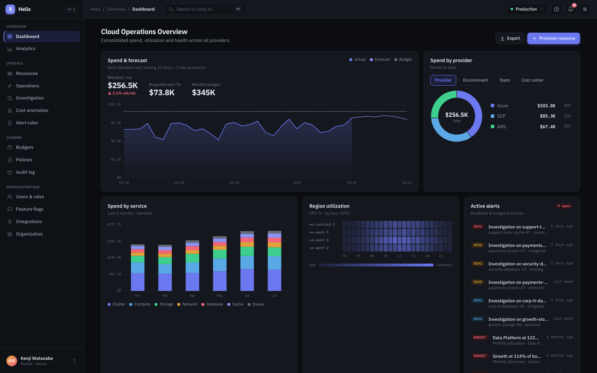
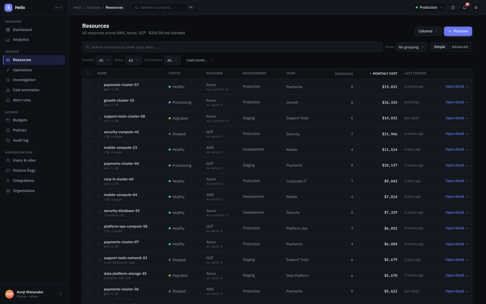
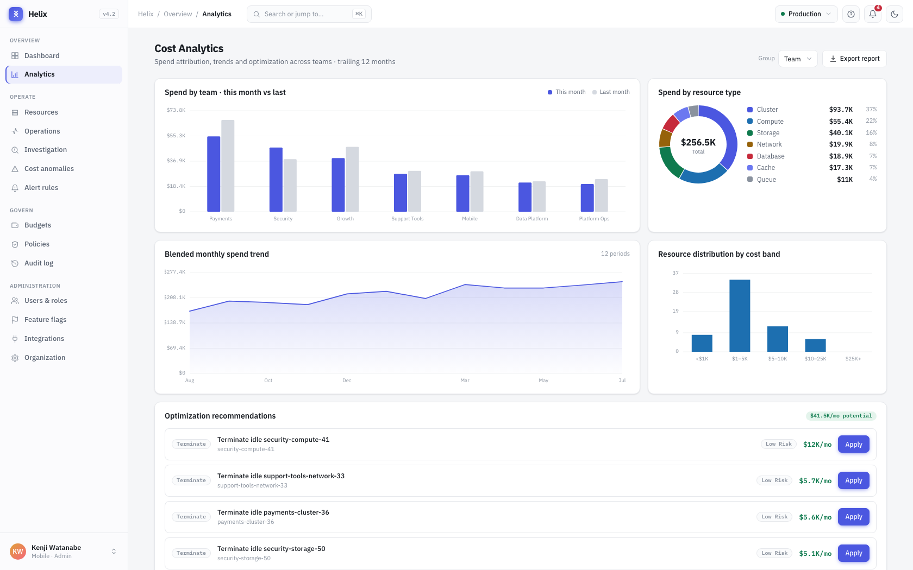
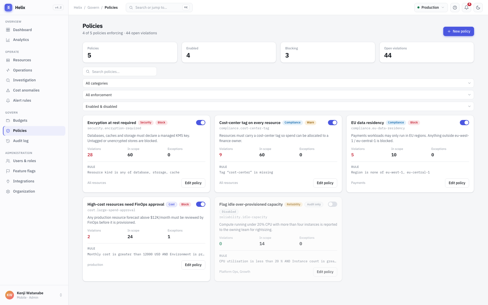
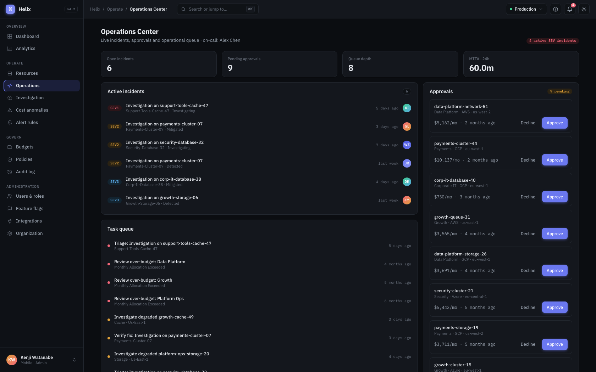
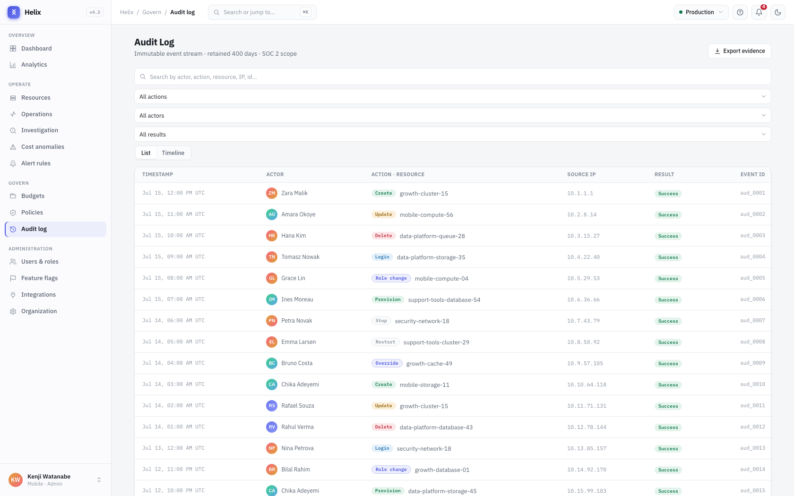

# Helix

**Enterprise Cloud Operations Platform** — a production-grade frontend built to
demonstrate how a real operational SaaS is engineered, not how a dashboard is
styled.

Helix models the working day of a cloud platform team: spend lands on a
dashboard, an anomaly becomes an investigation, the investigation leads to a
resource, the resource is reconfigured under policy, and every step of it shows
up in an immutable audit trail.



---

## What this is

A portfolio project, but built to production standards. There is no backend
service — the data layer is a **relational in-memory graph** with an async query
API designed to be swappable for a real REST API without touching the UI.

Everything is connected. Users belong to teams, teams own resources, resources
belong to provider accounts, budgets track team spend, policies evaluate against
live resources, and writes append to the shared activity and audit streams.
Nothing is an isolated mock array.

**Stack** — Next.js 16 (App Router) · React 19 · TypeScript (strict) ·
Tailwind CSS 4 · zero runtime dependencies beyond the framework.

Charts, overlays, the wizard engine, the shortcut layer and the data grid are
all hand-built. No component library, no charting library, no drag-and-drop
library, no state-management library.

---

## Screens

### Resources

Enterprise data grid: sorting, pagination, search, a nestable filter builder,
saved views, grouping, row expansion, bulk actions, column visibility and
drag-to-reorder.



### Analytics

Cost attribution by team, provider, environment or type; blended trend;
spend by resource type; cost-band distribution; and ranked optimization
recommendations.



### Policies

Governance rules evaluated against the real resource graph, with a live impact
preview — "what would this catch right now?" — while you author them.



### Operations

Incident queue, FinOps approval queue and the derived operational task list.



### Audit log

The immutable event stream: filters, full-text search, a timeline view, and a
before → after diff for every recorded change.



---

## Engineering highlights

**A shared wizard engine.** Five multi-step forms — provisioning, budgets,
policies, alert rules and resource configuration — run on one engine
(`shared/forms`) that owns conditional steps, per-step validation gating, live
validation, dirty tracking and whole-form submit. Each form declares its steps
and renders its fields; nothing else is duplicated.

**Permissions that actually govern the UI.** A seeded role matrix with
inheritance resolves into effective grants. Route access, sidebar entries,
command-palette actions and individual write buttons all derive from it. Switch
roles from the user menu to see the product change shape.

**Failure is a designed state.** Every screen has loading, empty and error
states. Offline is raised at the transport layer, so outages surface through
each screen's existing error path and recover automatically on reconnect.
Optimistic updates roll back with a reason when a write fails.

**Keyboard and pointer parity.** ⌘K command palette, `G`-then-key navigation,
`?` for a shortcuts guide generated from the same definitions the listener uses,
context menus reachable via Shift+F10, and drag-to-reorder that also works with
arrow keys and announces every move.

**Accessibility as a constraint, not a pass.** Focus traps and restoration on
overlays, `aria-invalid` / `aria-describedby` wired through the form layer,
live-region announcements for async and reorder events, a skip link, and a
`prefers-reduced-motion` guard over all motion.

---

## Running it

```bash
npm install
npm run dev          # http://localhost:3000
```

```bash
npm run build        # production build
npm run typecheck    # tsc --noEmit
npm run lint         # eslint
npm run format       # prettier --write
```

The seed is deterministic, so IDs and figures stay stable across restarts.
Mutations are held in memory and reset on reload.

---

## Architecture

```
src/
  app/                Routes (App Router) — thin; screens live in features/
  features/           One folder per product area, self-contained
    resources/          data grid, filter builder, saved views, bulk actions
    resource-detail/    detail screen + edit-configuration form
    operations/         incident queue and approvals
    investigation/      incident war-room
    analytics/          cost reporting
    anomalies/ budgets/ policies/ alerts/
    users/ flags/ integrations/ organization/ audit/
    provisioning/       provisioning wizard
  lib/backend/        The fake backend
    models.ts           domain types — relationships by ID
    seed.ts             deterministic seeder
    queries/            async query + mutation layer, one module per area
  shared/
    ui/                 primitives (Button, Dialog, Drawer, Select, …)
    forms/              wizard engine + form building blocks
    charts/             hand-built SVG charts
    session/            identity and permission gating
    keyboard/           shortcut layer and guide
    layout/ command/ hooks/ nav/ theme/ icons/ lib/
```

**Feature-based, not layer-based.** A feature owns its view, components,
constants, helpers and types. Anything used by two features moves to `shared/`.

**The backend boundary is honest.** Query modules return hydrated view models
over `await`-able calls with simulated latency, so swapping the in-memory store
for HTTP is a change inside `lib/backend` alone.

---

## Project history

Built in ten phases, each a complete vertical slice rather than a layer:
foundation, application shell, resource management, operations, analytics,
administration, audit, enterprise forms, system states and interactions, and
final polish. The full phase log lives in [`CLAUDE.md`](CLAUDE.md).
